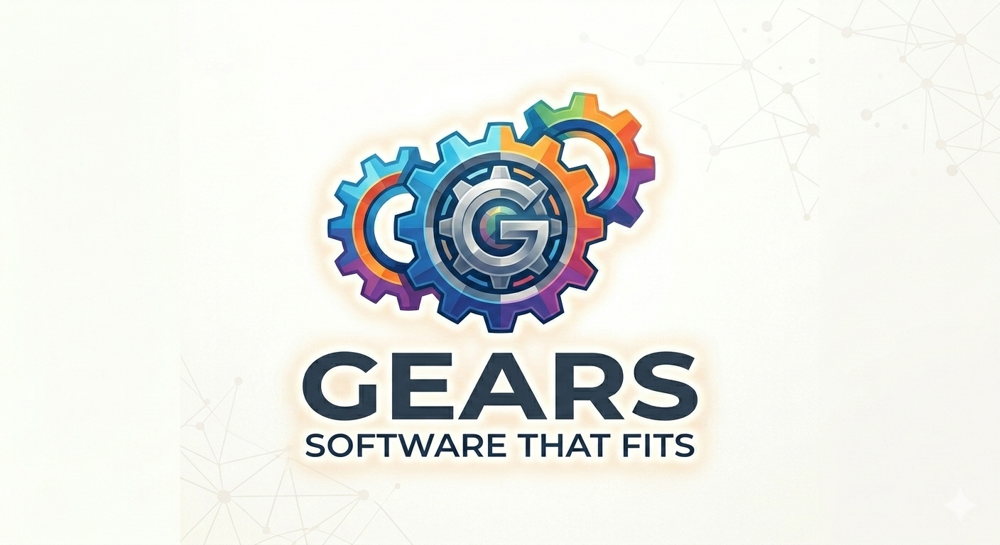
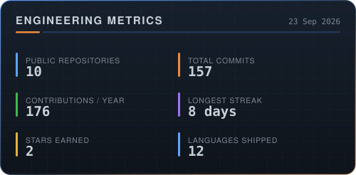
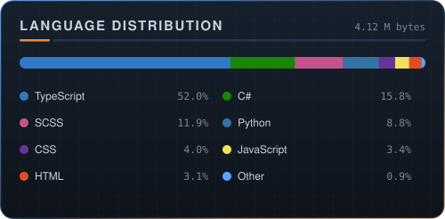
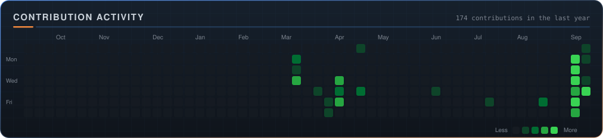
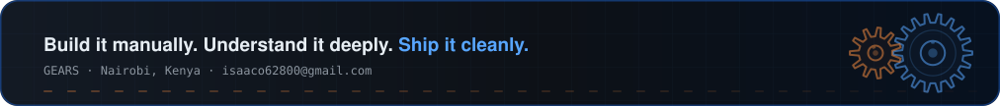

<!--
  ISAAC ONYANGO — GitHub profile README
  Repo: Isaac-Onyango-Dev/Isaac-Onyango-Dev

  The stat cards in this file are generated into /assets by
  scripts/build_profile.py and refreshed daily by .github/workflows/profile.yml.
  Nothing here depends on a third-party stats service.
-->

<div align="center">
  <a href="https://github.com/Isaac-Onyango-Dev?tab=repositories">
    
  </a>
</div>

<div align="center">

[](https://github.com/Isaac-Onyango-Dev?tab=repositories)
[](https://isaac-onyango-dev.github.io/My-Portfolio/)
[](mailto:isaaco62800@gmail.com)
[](https://github.com/Isaac-Onyango-Dev?tab=followers)
[](mailto:isaaco62800@gmail.com)

</div>

---

## &nbsp;`01`&nbsp; About



I build software that fits the problem it was made for. My work runs across
desktop, web and mobile, and most of it starts the same way: take something
people do by hand, understand every step of it, then ship a tool that does it
cleanly.

| | |
|:--|:--|
| **Focus** | Full-stack product work — TypeScript front ends on Python and Node services |
| **Currently** | [StreamDock](https://github.com/Isaac-Onyango-Dev/StreamDock) and [Internet Download Hub](https://github.com/Isaac-Onyango-Dev/Internet-Download-Hub) — cross-platform media tooling on Electron, yt-dlp and FFmpeg |
| **Studying** | TVET CDACC KNQF Level 6, Computer Science · distributed systems · applied ML |
| **Also** | Graphic design, motion and original manga worldbuilding |
| **Based in** | Nairobi, Kenya 🇰🇪 |
| **Open to** | Freelance work, collaborations, open-source contributions |
| **Philosophy** | *Build it manually. Understand it deeply. Ship it cleanly.* |

<br clear="right"/>

---

## &nbsp;`02`&nbsp; Repositories

> Every project below links straight to its source and, where one exists, a live build.
> This table rebuilds itself daily, so it never falls behind the account.

<!-- REPOS:START -->
<table>
<tr>
<td width="50%" valign="top">

#### [Internet-Download-Hub](https://github.com/Isaac-Onyango-Dev/Internet-Download-Hub)

Internet Download Hub is a free Windows desktop application that lets you download videos from over 1000 websites…

`TypeScript` &nbsp;·&nbsp; ★ 1 &nbsp;·&nbsp; `downloader` `electron-app` `ffmpeg`

<a href="https://github.com/Isaac-Onyango-Dev/Internet-Download-Hub"></a> <a href="https://isaac-onyango-dev.github.io/Internet-Download-Hub/"></a>

</td>
<td width="50%" valign="top">

#### [Complex-Developers-Web](https://github.com/Isaac-Onyango-Dev/Complex-Developers-Web)

This is the official complex developers website where we offer a vast majority of services

`Mixed` &nbsp;·&nbsp; ★ 1

<a href="https://github.com/Isaac-Onyango-Dev/Complex-Developers-Web"></a> <a href="https://complex-developers-web.vercel.app/"></a>

</td>
</tr>
<tr>
<td width="50%" valign="top">

#### [MediaGrab](https://github.com/Isaac-Onyango-Dev/MediaGrab)

No description yet.

`Python`

<a href="https://github.com/Isaac-Onyango-Dev/MediaGrab"></a> <a href="https://isaac-onyango-dev.github.io/MediaGrab/"></a>

</td>
<td width="50%" valign="top">

#### [My-Portfolio](https://github.com/Isaac-Onyango-Dev/My-Portfolio)

Isaac Onyango's Portfolio

`JavaScript`

<a href="https://github.com/Isaac-Onyango-Dev/My-Portfolio"></a> <a href="https://isaac-onyango-dev.github.io/My-Portfolio/"></a>

</td>
</tr>
<tr>
<td width="50%" valign="top">

#### [StreamDock](https://github.com/Isaac-Onyango-Dev/StreamDock)

No description yet.

`TypeScript` &nbsp;·&nbsp; `cross-platform` `downloader` `electron`

<a href="https://github.com/Isaac-Onyango-Dev/StreamDock"></a> <a href="https://isaac-onyango-dev.github.io/StreamDock/"></a>

</td>
<td width="50%" valign="top">

#### [KeyHunter](https://github.com/Isaac-Onyango-Dev/KeyHunter)

No description yet.

`Mixed`

<a href="https://github.com/Isaac-Onyango-Dev/KeyHunter"></a>

</td>
</tr>
<tr>
<td width="50%" valign="top">

#### [ScamShield](https://github.com/Isaac-Onyango-Dev/ScamShield)

This app helps users detect and report suspicious online job and service scams.

`TypeScript` &nbsp;·&nbsp; `audit` `scam` `security`

<a href="https://github.com/Isaac-Onyango-Dev/ScamShield"></a> <a href="https://isaac-onyango-dev.github.io/ScamShield/"></a>

</td>
<td width="50%" valign="top">

#### [daniel](https://github.com/Isaac-Onyango-Dev/daniel)

No description yet.

`HTML`

<a href="https://github.com/Isaac-Onyango-Dev/daniel"></a>

</td>
</tr>
</table>
<!-- REPOS:END -->

<div align="center">

[](https://github.com/Isaac-Onyango-Dev?tab=repositories)

</div>

---

## &nbsp;`03`&nbsp; Toolchain

<table>
<tr><td width="150"><b>Languages</b></td><td>

</td></tr>
<tr><td><b>Front end</b></td><td>

</td></tr>
<tr><td><b>Back end</b></td><td>

</td></tr>
<tr><td><b>Data</b></td><td>

</td></tr>
<tr><td><b>Platform</b></td><td>

</td></tr>
<tr><td><b>Design</b></td><td>

</td></tr>
</table>

---

## &nbsp;`04`&nbsp; By the numbers

<div align="center">


&nbsp;




</div>

---

## &nbsp;`05`&nbsp; Contribution snake

<div align="center">

<picture>
  <source media="(prefers-color-scheme: dark)"
    srcset="https://raw.githubusercontent.com/Isaac-Onyango-Dev/Isaac-Onyango-Dev/output/github-contribution-grid-snake-dark.svg"/>
  <source media="(prefers-color-scheme: light)"
    srcset="https://raw.githubusercontent.com/Isaac-Onyango-Dev/Isaac-Onyango-Dev/output/github-contribution-grid-snake.svg"/>
  
</picture>

</div>

---

## &nbsp;`06`&nbsp; Roadmap

```text
TVET CDACC KNQF Level 6 — Computer Science
│
├── [done]  Networking fundamentals
├── [done]  Graphic design & digital media
├── [wip ]  Web development ........... React · TypeScript · Next.js · FastAPI
├── [wip ]  Database management ....... PostgreSQL · MongoDB · Supabase · Redis
├── [wip ]  Python & automation ....... CLI tooling · APIs · scripting
├── [next]  Distributed systems ....... Docker · microservices · load balancing
└── [next]  AI / ML .................... TensorFlow · PyTorch · LLM integration
```

---

## &nbsp;`07`&nbsp; Elsewhere

<div align="center">

[](https://x.com/isaaco62800)
[](https://discord.gg/mao10018)
[](https://instagram.com/isaac62800)
[](https://tiktok.com/@iz_c25)
[](https://reddit.com/user/Tricky_Fill8539)
[](https://ko-fi.com/gearsdev)
[](https://patreon.com/gearsdev)

</div>

<div align="center">
  <br/>
  
</div>
